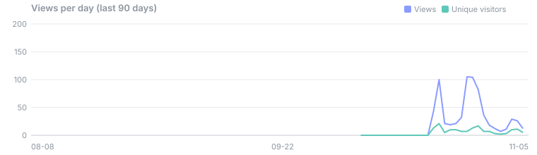
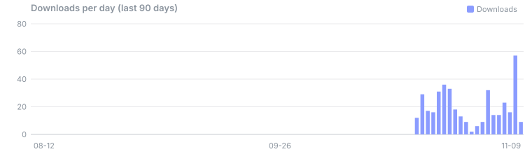
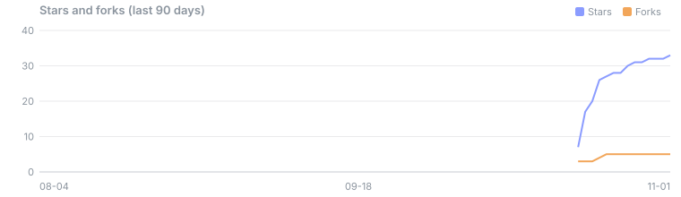

# SpaceKnife stats

Traffic, stars, forks and downloads of [DuskXi/SpaceKnife](https://github.com/DuskXi/SpaceKnife), collected every day by [`.github/workflows/stats.yml`](.github/workflows/stats.yml) with [github-repo-stats](https://github.com/jgehrcke/github-repo-stats) and [`scripts/report.py`](scripts/report.py). Updated 2026-11-10 (UTC).

**Dashboard:** https://duskxi.github.io/spaceknife-stats/ · **Detailed traffic report:** https://duskxi.github.io/spaceknife-stats/report/report.html

| Stars | Forks | Downloads | Views, 14 days | Clones, 14 days |
|---:|---:|---:|---:|---:|
| 43 | 6 | 509 | 317 | 382 |

## Last 30 days

| Day (UTC) | Views | Visitors | Clones | Cloners | Stars | Downloads |
| --- | ---: | ---: | ---: | ---: | ---: | ---: |
| 2026-11-10 | — | — | — | — | 43 | 62 |
| 2026-11-09 | 22 | 7 | 48 | 8 | 42 | 9 |
| 2026-11-08 | 40 | 10 | 155 | 13 | 42 | 57 |
| 2026-11-07 | 18 | 5 | 6 | 5 | 41 | 16 |
| 2026-11-06 | 57 | 16 | 36 | 10 | 40 | 23 |
| 2026-11-05 | 29 | 13 | 5 | 4 | 37 | 14 |
| 2026-11-04 | 12 | 5 | 61 | 2 | 35 | 14 |
| 2026-11-03 | 26 | 11 | 6 | 4 | 35 | 32 |
| 2026-11-02 | 29 | 10 | 7 | 5 | 35 | 9 |
| 2026-11-01 | 11 | 3 | 1 | 1 | 33 | 6 |
| 2026-10-31 | 7 | 2 | 5 | 3 | 32 | 2 |
| 2026-10-30 | 12 | 3 | 6 | 6 | 32 | 9 |
| 2026-10-29 | 18 | 7 | 11 | 9 | 32 | 13 |
| 2026-10-28 | 36 | 7 | 35 | 18 | 31 | 18 |
| 2026-10-27 | 82 | 17 | 25 | 9 | 31 | 33 |
| 2026-10-26 | 104 | 13 | 119 | 22 | 30 | 36 |
| 2026-10-25 | 105 | 7 | 174 | 32 | 28 | 31 |
| 2026-10-24 | 32 | 7 | 30 | 10 | 28 | 16 |
| 2026-10-23 | 21 | 10 | 55 | 22 | 27 | 17 |
| 2026-10-22 | 19 | 10 | 138 | 30 | 26 | 29 |
| 2026-10-21 | 21 | 5 | 297 | 64 | 20 | 12 |
| 2026-10-20 | 100 | 21 | 325 | 80 | 17 | — |
| 2026-10-19 | 43 | 13 | 374 | 59 | 7 | — |
| 2026-10-18 | 0 | 0 | 0 | 0 | — | — |
| 2026-10-17 | 0 | 0 | 0 | 0 | — | — |
| 2026-10-16 | 0 | 0 | 0 | 0 | — | — |
| 2026-10-15 | 0 | 0 | 0 | 0 | — | — |
| 2026-10-14 | 0 | 0 | 0 | 0 | — | — |
| 2026-10-13 | 0 | 0 | 0 | 0 | — | — |
| 2026-10-12 | 0 | 0 | 0 | 0 | — | — |

## Downloads by release

| Release | Downloads | Last 7 days |
| --- | ---: | ---: |
| v0.3.4 (pre-release) | 326 | 188 |
| v0.3.3 (pre-release) | 105 | 3 |
| v0.3.2 (pre-release) | 19 | 1 |
| v0.3.1 (pre-release) | 44 | 3 |
| v0.3.0 (pre-release) | 15 | 0 |

## Downloads by file

| Release | File | Downloads | Last 7 days |
| --- | --- | ---: | ---: |
| v0.3.4 | `SpaceKnife-0.3.4-Setup-x64.exe` | 122 | 67 |
| v0.3.4 | `SpaceKnife-0.3.4-win-x64-portable.zip` | 73 | 39 |
| v0.3.4 | `SpaceKnife-0.3.4-x86_64.AppImage` | 20 | 9 |
| v0.3.4 | `SpaceKnife-0.3.4-mac-arm64.dmg` | 19 | 11 |
| v0.3.4 | `SpaceKnife-0.3.4-linux-x64-portable.tar.gz` | 15 | 9 |
| v0.3.4 | `SpaceKnife-0.3.4-win-arm64-portable.zip` | 14 | 10 |
| v0.3.4 | `spaceknife_0.3.4_amd64.deb` | 13 | 8 |
| v0.3.4 | `SpaceKnife-0.3.4-mac-arm64-portable.zip` | 11 | 8 |
| v0.3.4 | `SpaceKnife-0.3.4-mac-x64-portable.zip` | 11 | 8 |
| v0.3.4 | `SpaceKnife-0.3.4-mac-x64.dmg` | 11 | 7 |
| v0.3.4 | `SpaceKnife-0.3.4-linux-arm64-portable.tar.gz` | 10 | 7 |
| v0.3.4 | `spaceknife-0.3.4.x86_64.rpm` | 7 | 5 |
| v0.3.4 | `SHA256SUMS.txt` ¹ | 54 | 30 |
| v0.3.4 | `SHA256SUMS-portable-win-x64.txt` ¹ | 15 | 11 |
| v0.3.4 | `SHA256SUMS-mac-arm64.txt` ¹ | 10 | 6 |
| v0.3.4 | `SHA256SUMS-mac-x64.txt` ¹ | 8 | 5 |
| v0.3.4 | `SHA256SUMS-portable-linux-arm64.txt` ¹ | 7 | 5 |
| v0.3.4 | `SHA256SUMS-portable-linux-x64.txt` ¹ | 7 | 5 |
| v0.3.4 | `SHA256SUMS-portable-win-arm64.txt` ¹ | 7 | 5 |
| v0.3.4 | `SpaceKnife-0.3.4-x86_64.AppImage.zsync` ¹ | 6 | 2 |
| v0.3.3 | `SpaceKnife-0.3.3-Setup-x64.exe` | 64 | 2 |
| v0.3.3 | `SpaceKnife-0.3.3-win-x64-portable.zip` | 19 | 1 |
| v0.3.3 | `SpaceKnife-0.3.3-mac-arm64.dmg` | 9 | 0 |
| v0.3.3 | `SpaceKnife-0.3.3-x86_64.AppImage` | 7 | 0 |
| v0.3.3 | `spaceknife_0.3.3_amd64.deb` | 4 | 0 |
| v0.3.3 | `SpaceKnife-0.3.3-linux-x64-portable.tar.gz` | 1 | 0 |
| v0.3.3 | `SpaceKnife-0.3.3-mac-x64.dmg` | 1 | 0 |
| v0.3.3 | `spaceknife-0.3.3.x86_64.rpm` | 0 | 0 |
| v0.3.3 | `SHA256SUMS.txt` ¹ | 17 | 0 |
| v0.3.3 | `SHA256SUMS-mac-arm64.txt` ¹ | 3 | 0 |
| v0.3.3 | `SHA256SUMS-portable-win-x64.txt` ¹ | 2 | 0 |
| v0.3.3 | `SHA256SUMS-mac-x64.txt` ¹ | 1 | 0 |
| v0.3.3 | `SHA256SUMS-portable-linux-x64.txt` ¹ | 1 | 0 |
| v0.3.3 | `SpaceKnife-0.3.3-x86_64.AppImage.zsync` ¹ | 1 | 0 |
| v0.3.2 | `SpaceKnife-0.3.2-Setup-x64.exe` | 17 | 0 |
| v0.3.2 | `SpaceKnife-0.3.2-linux-x64-portable.tar.gz` | 1 | 0 |
| v0.3.2 | `SpaceKnife-0.3.2-win-x64-portable.zip` | 1 | 1 |
| v0.3.2 | `SpaceKnife-0.3.2-mac-arm64.dmg` | 0 | 0 |
| v0.3.2 | `SpaceKnife-0.3.2-mac-x64.dmg` | 0 | 0 |
| v0.3.2 | `SpaceKnife-0.3.2-x86_64.AppImage` | 0 | 0 |
| v0.3.2 | `spaceknife-0.3.2.x86_64.rpm` | 0 | 0 |
| v0.3.2 | `spaceknife_0.3.2_amd64.deb` | 0 | 0 |
| v0.3.2 | `SHA256SUMS.txt` ¹ | 8 | 0 |
| v0.3.2 | `SHA256SUMS-mac-arm64.txt` ¹ | 1 | 0 |
| v0.3.2 | `SHA256SUMS-mac-x64.txt` ¹ | 1 | 0 |
| v0.3.2 | `SHA256SUMS-portable-linux-x64.txt` ¹ | 1 | 0 |
| v0.3.2 | `SHA256SUMS-portable-win-x64.txt` ¹ | 1 | 0 |
| v0.3.2 | `SpaceKnife-0.3.2-x86_64.AppImage.zsync` ¹ | 0 | 0 |
| v0.3.1 | `SpaceKnife-0.3.1-Setup-x64.exe` | 16 | 0 |
| v0.3.1 | `SpaceKnife-0.3.1-win-x64-portable.zip` | 14 | 2 |
| v0.3.1 | `SpaceKnife-0.3.1-x86_64.AppImage` | 6 | 0 |
| v0.3.1 | `SpaceKnife-0.3.1-mac-arm64.dmg` | 3 | 0 |
| v0.3.1 | `SpaceKnife-0.3.1-linux-x64-portable.tar.gz` | 2 | 1 |
| v0.3.1 | `SpaceKnife-0.3.1-mac-x64.dmg` | 1 | 0 |
| v0.3.1 | `spaceknife-0.3.1.x86_64.rpm` | 1 | 0 |
| v0.3.1 | `spaceknife_0.3.1_amd64.deb` | 1 | 0 |
| v0.3.1 | `SHA256SUMS.txt` ¹ | 4 | 0 |
| v0.3.1 | `SHA256SUMS-mac-arm64.txt` ¹ | 1 | 0 |
| v0.3.1 | `SHA256SUMS-mac-x64.txt` ¹ | 1 | 0 |
| v0.3.1 | `SHA256SUMS-portable-linux-x64.txt` ¹ | 1 | 0 |
| v0.3.1 | `SHA256SUMS-portable-win-x64.txt` ¹ | 1 | 0 |
| v0.3.0 | `SpaceKnife-0.3.0-Setup-x64.exe` | 10 | 0 |
| v0.3.0 | `SpaceKnife-0.3.0-x86_64.AppImage` | 3 | 0 |
| v0.3.0 | `spaceknife-0.3.0.x86_64.rpm` | 1 | 0 |
| v0.3.0 | `spaceknife_0.3.0_amd64.deb` | 1 | 0 |
| v0.3.0 | `SHA256SUMS.txt` ¹ | 2 | 0 |

## Referrers (latest 14 days)

| Referrer | Views | Visitors |
| --- | ---: | ---: |
| github.com | 36 | 25 |
| spaceknife.kaltsit.dev | 10 | 9 |
| Bing | 6 | 6 |
| Google | 6 | 6 |
| fondoblanco.org | 1 | 1 |
| meta.appinn.net | 1 | 1 |
| oschina.net | 1 | 1 |
| qianwen.com | 1 | 1 |

## Popular pages (latest 14 days)

| Page | Views | Visitors |
| --- | ---: | ---: |
| `/DuskXi/SpaceKnife` | 163 | 49 |
| `/DuskXi/SpaceKnife/releases` | 94 | 47 |
| `/DuskXi/SpaceKnife/blob/main/README.zh-CN.md` | 22 | 18 |
| `/DuskXi/SpaceKnife/pulls` | 13 | 3 |
| `/DuskXi/SpaceKnife/releases/tag/v0.3.4` | 10 | 7 |
| `/DuskXi/SpaceKnife/tree/main` | 9 | 8 |
| `/DuskXi/SpaceKnife/graphs/traffic` | 9 | 1 |
| `/DuskXi/SpaceKnife/pulse` | 8 | 1 |
| `/DuskXi/SpaceKnife/tags` | 5 | 5 |
| `/DuskXi/SpaceKnife/commits/main` | 5 | 2 |

## Notes

- Views, visitors, clones, referrers and pages come from GitHub's traffic API, which keeps 14 days; this repo keeps them for good. Days are UTC.
- Clones include GitHub Actions checkouts (SpaceKnife's own CI), so they don't count people.
- Downloads count the installers and archives. ¹ Checksum and `.zsync` files are fetched by tools: listed, not counted.
- Downloads per day are the change between two daily snapshots, so they start the day after the first one; until there is a week of snapshots, "last 7 days" counts from the first.

Raw data: [`DuskXi/SpaceKnife/ghrs-data/`](DuskXi/SpaceKnife/ghrs-data/), [`DuskXi/SpaceKnife/downloads/downloads.csv`](DuskXi/SpaceKnife/downloads/downloads.csv).
